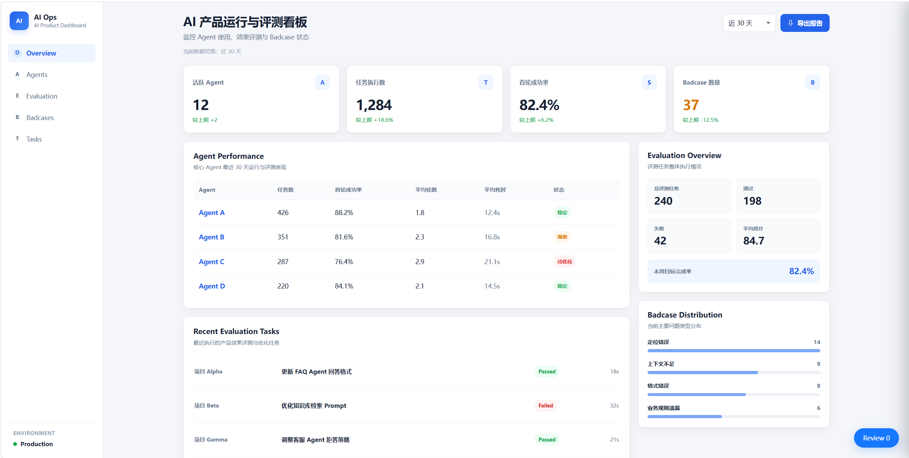
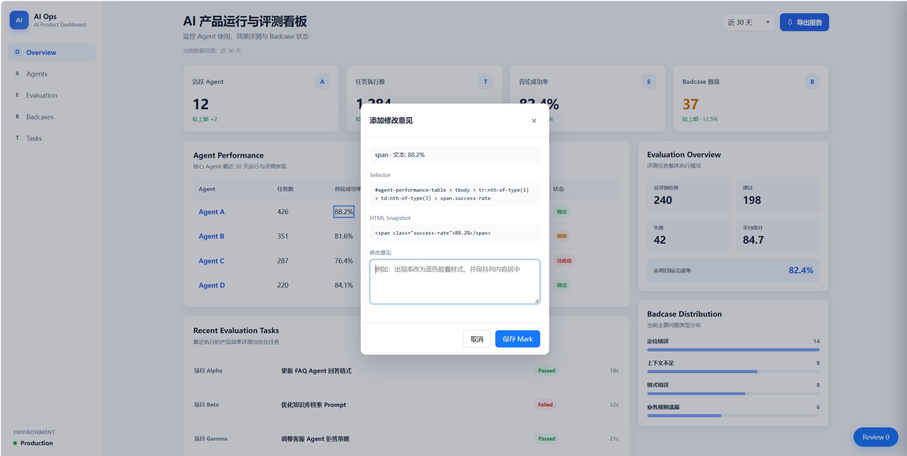
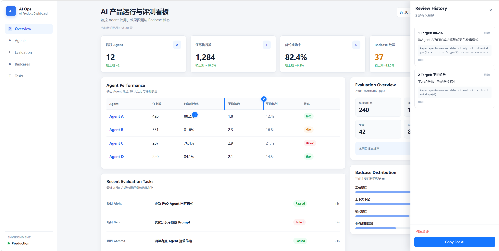
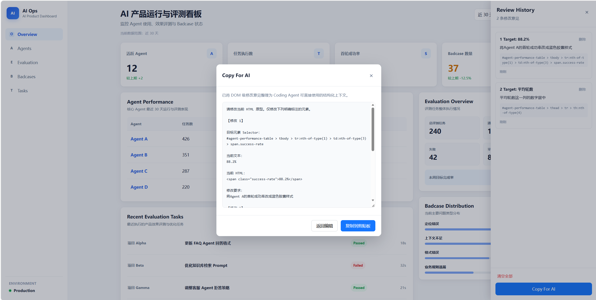
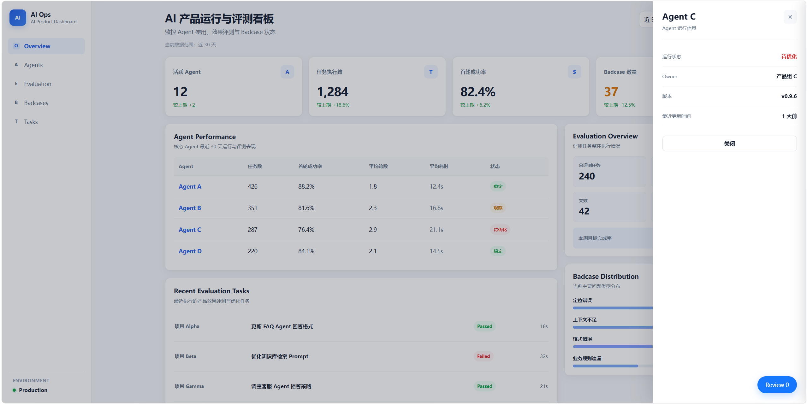

# ProtoLens — AI HTML Prototype Reviewer

把网页原型里的“这里改一下”，转换成 Coding Agent 能直接理解的 DOM 级修改上下文。



## 为什么做这个项目

AI 生成 HTML 原型很快，但进入修改阶段后，沟通成本会迅速上升。

产品反馈通常是“这个数字改成蓝色”“这一列居中”“这个状态样式和上面保持一致”。如果只靠截图和自然语言，Coding Agent 还需要再判断目标元素、页面层级和修改范围；而修改意见一多，前后文也很容易散掉。

ProtoLens 的目标不是替代 Coding Agent，而是补上产品反馈到代码修改之间这一层上下文：

**页面点选 → DOM 定位 → 修改意见 → Review History → Copy For AI → Coding Agent**

V1.0 只做这条链路，不做直接改源码、后端、多人协作和浏览器插件。

## 我做了什么

这是一个面向 AI Coding 场景的轻量 HTML Reviewer。当前版本包括：

- Ctrl / Cmd + Click 选择真实 DOM
- Hover / Selected 元素高亮
- CSS Selector 自动生成
- Current Text 与 HTML Snapshot 捕获
- Mark 修改意见
- 页面级 localStorage 持久化
- Review Pin 与 Review History
- Copy For AI 结构化上下文导出
- 不同 HTML 页面之间的 Review Session 隔离
- 长 HTML Snapshot 的弹窗滚动与视口适配
- Reviewer CSS 与宿主页面样式隔离

角色：独立项目  
工作内容：问题定义、MVP 范围、交互设计、前端实现、测试集设计、A/B 评测与 Badcase 迭代

## 核心流程

### 1. 选中页面元素

在 HTML 原型中按住 Ctrl / Cmd 点击目标元素，Reviewer 会记录 Selector、当前文本和 HTML Snapshot。



### 2. 保存修改意见

每条反馈都绑定到具体 DOM，而不是只留在截图或聊天记录里。页面上的 Pin 和右侧 Review History 可以回看多条意见。



### 3. 生成给 Coding Agent 的上下文

Copy For AI 会把多条 Mark 整理为结构化文本，包括：

- Selector
- Current Text
- HTML Snapshot
- Modification Intent
- 固定修改约束



### 4. 不破坏原页面交互

Reviewer 作为注入层工作，普通点击仍保留页面自己的交互，例如 Agent Detail Drawer。



## 一条 Mark 的数据结构

```js
{
  id,
  selector,
  text,
  html,
  note,
  createdAt
}
```

对应的输出上下文示例：

```text
目标元素 Selector:
#agent-performance-table > tbody > tr:nth-of-type(1) > td:nth-of-type(3) > span.success-rate

当前文本:
88.2%

当前 HTML:
<span class="success-rate">88.2%</span>

修改要求:
将 Agent A 的首轮成功率改成蓝色胶囊样式
```

这一步是 ProtoLens 的核心：把产品经理的视觉反馈，转换成 Agent 可消费的代码上下文。

## 评测

我没有把“Reviewer 一定比自然语言更准”当成既定结论，而是分三轮验证。

### Functional Benchmark

10 个基础 HTML 修改任务，覆盖 Text / Style / Layout / Structure。

| Metric | Natural Language | Reviewer |
| --- | ---: | ---: |
| First-round Success | 100% | 100% |
| Average Conversation Rounds | 1.0 | 1.0 |
| Wrong DOM Count | 0 | 0 |
| Average Agent Time | 32.8s | 32.5s |

基础任务里，两种方式差异很小。

### Stress Test

5 个高歧义任务，包括重复文本、无文本 DOM、组件级修改和父子节点操作。

| Metric | Natural Language | Reviewer |
| --- | ---: | ---: |
| First-round Success | 100% | 100% |
| Average Agent Time | 35.4s | 33.0s |
| Average E2E Time | 67.8s | 60.2s |

这一轮中，Reviewer 工作流平均 E2E 时间从 **67.8s 降至 60.2s，下降约 11.2%**。5 个任务里，Reviewer 的 E2E 时间都更短。

### Fair Localization Benchmark

为了单独验证“定位准确率”，又做了一轮受控测试：

- A 组：Coding Agent 直接接收普通 Prompt P
- B 组：Mark 中填写完全相同的 Prompt P，Coding Agent 只接收 Reviewer 生成的上下文
- 不提供截图，不额外补充 DOM 描述

12 组复杂定位任务中，两组都正确定位目标，Localization Accuracy 都是 **100%**。

所以 V1.0 的结论不是“Reviewer 提高了强 Coding Agent 的 DOM 定位准确率”。

更准确的结论是：

- 简单任务里，完整 HTML + 自然语言已经足够；
- 高歧义任务中，结构化 Reviewer 工作流在本轮测试里减少了端到端操作时间；
- DOM Context 的价值更偏向**组织反馈、限定修改范围和保存上下文**，而不是替代模型本身的代码理解能力。

完整测试记录见 [`evaluation/README.md`](evaluation/README.md)。

## 两个有价值的 Badcase

### Element-level Picker 的粒度限制

对于：

```html
<td>351</td>
```

当前 Picker 最小只能选择 `<td>`，无法单独选择 Text Node `351`。

这会导致“只改数字背景”这类视觉意图，有时被 Coding Agent 实现为整个单元格背景。这个问题保留为 V1.0 Known Limitation，后续考虑 Text Node / Range Selection。

### 修改范围不等于定位是否正确

在一组 Drawer 状态样式实验里，两组都找对了目标。直接自然语言方案复用了已有状态 class，同时带入了额外背景色；Reviewer 方案只修改了目标文字颜色。

这个结果没有证明定位准确率提升，但提醒我：**评测不能只看“找没找对”，还要看修改范围是否符合原始意图。**

更多问题与修复记录见 [`cases/badcases.md`](cases/badcases.md)。

## 产品取舍

V1.0 刻意没有加入：

- React / Vue 重构
- 后端和数据库
- 登录与多人协作
- 直接写回 HTML 源文件
- 视觉截图识别
- 浏览器插件

原因很简单：这一版先验证“DOM 级 Review Context 是否值得存在”。

如果这个前提成立，再考虑 Direct Edit、协作和自动回归，而不是一开始把项目做成完整 IDE。

## Quick Start

项目没有额外依赖，建议使用 VS Code + Live Server。

1. Clone / 下载项目。
2. 用 VS Code 打开项目根目录。
3. 使用 Live Server 打开 `demo.html` 或 `cases/ai_product_dashboard_prototype.html`。
4. 按住 Ctrl（macOS 使用 Cmd）点击目标元素。
5. 输入修改意见并保存 Mark。
6. 打开 Review History。
7. 点击 **Copy For AI**，将结果交给 Coding Agent。

## Repository

```text
.
├── cases/
│   ├── ai_product_dashboard_prototype.html
│   ├── badcases.md
│   └── test-cases.md
├── docs/
│   └── images/
├── evaluation/
│   ├── README.md
│   ├── results.csv
│   ├── stress_results.csv
│   ├── fair_localization_results.csv
│   ├── task-results/
│   ├── stress-results/
│   └── fair_localization_results/
├── demo.html
├── reviewer.css
├── reviewer.js
└── README.md
```

## V1.0 之后

下一步更值得做的不是继续堆功能，而是解决已经被测试暴露出来的问题：

- Text Node / Range Selection
- 更细粒度的 Context Capture
- Review Session 导入 / 导出
- 修改前后 Diff
- 自动回归检查
- 多人 Review / Comment

---

这个项目的重点不是“做了一个 DOM 工具”，而是把一段真实的 AI 产品工作流拆开、验证，再用测试结果反过来收缩产品定位。
